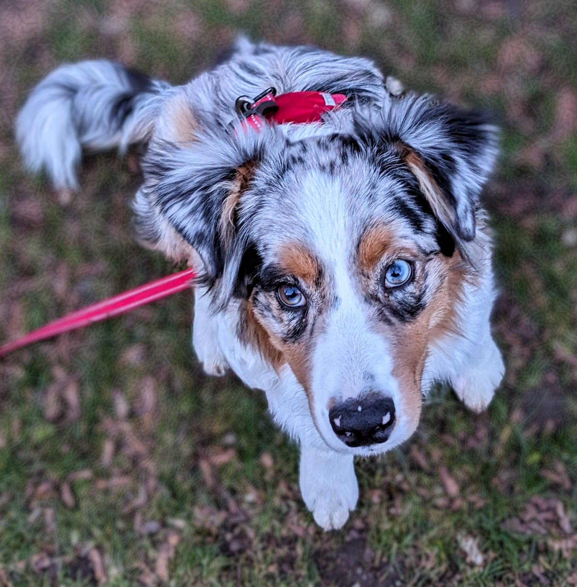
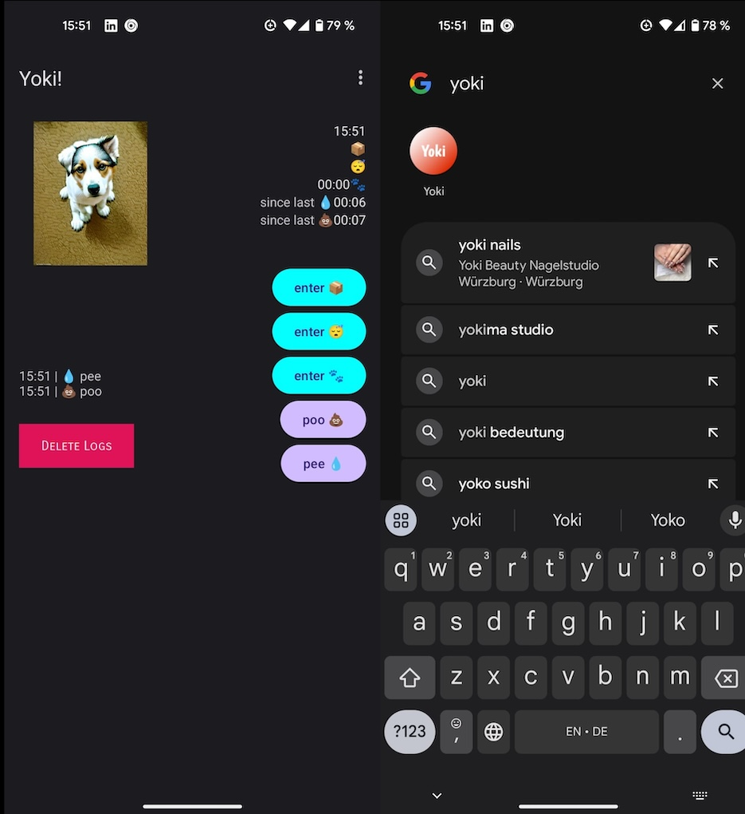
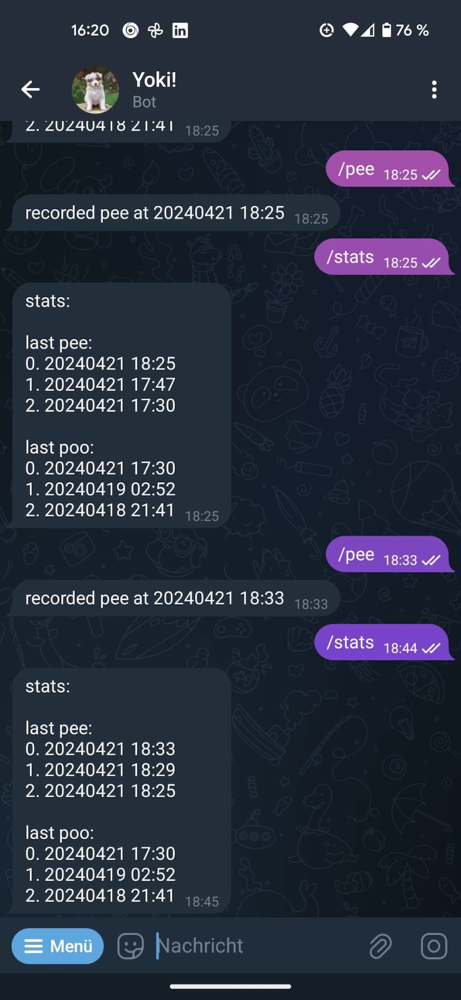
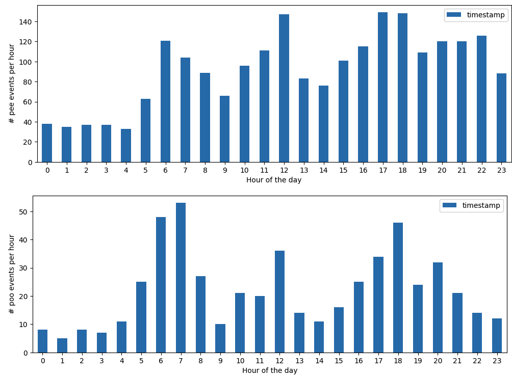
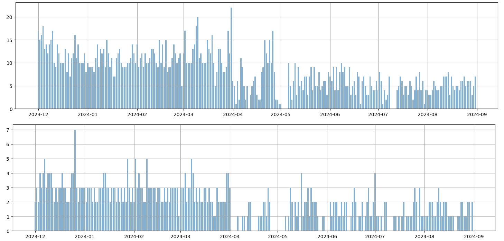

# Dog stats

If you ever consider of getting a dog, this page might help you estimate how much to expect in the first year. We bought a dog in October 2023 and called her *Yoki*. Here is the picture of the beast: 

From the start we decided to scientifically approach the training process and track her activities. The question was where to track them? After searching for out-of-the-box solutions in the Web, Playstore and Android I decided to make my own Android app to track her pee and poo events. This was my first encounter with [Kotlin for Android](https://kotlinlang.org/docs/android-overview.html) and it has been a steep learning curve. The resulting app looked super basic and could track pee and poo events, as well as walk durations and how much time she spends in a box. 

This was a great learning pet project but it turned out to be absolutely not practical to track all this in the android app, given that my wife had an iPhone...

Second attempt was to code up an telegram bot. By the time I decided to use [Telegram Bot API](https://core.telegram.org/bots), which turned out to be super powerful, we already decided that we only need `pee` and `poo` statistics, cause this is what bothered us most. Thus the bot was focusing on only tracking toilet data and providing some statistics about it. This looked like so:

However, somehow complicated `/pee`, `/poo` or `/stats` commands did not work well in real life applications. I struggled to find a character `/` on my phone while standing on the side of the road with cars passig by, dog jumping around and a pile of shit that I was trying not to step into. It was much more convenient to type `pee 12:30` later on in calmer place. Additionally, we wanted to share the information in our family, meaning that another family member should know when did the dog last time do her business.

The most convenient option turned out to be a simple common chat, where we posted the events. WhatsApp was our end choice for convenience reasons. [Meta can share this information](https://en.wikipedia.org/wiki/Reception_and_criticism_of_WhatsApp_security_and_privacy_features), it is shit anyway...

## Data insights

So what can one learn from such data? ...

Yoki was born on Septemebr 1st 2023, but reliable stats where only collected starting from December 2023. Today I am posting the data till August 2024. Data can be downloaded in CSV format: [pee timeseries](data/pee.csv) and [poo timeseries](data/poo.csv). I used [this Jupyter Notebook](charts.ipynb) to plot charts below.

Data is structured the following way:

|    | timestamp           |
| :--| :------------------ |
| 0  | 2023-11-17 08:30:00 |
| 1  | 2023-12-01 02:27:00 |
| 2  | 2023-12-01 06:04:00 |

There are `2212` pee events and `528` poo events. Plotting number of events per hour of the day one sees the following picture:

Poo events cluster around 06:00/07:00 in the morning and 18:00 in the evening. If you are getting a young puppy look at the pee chart. It is all over the place, except relatively calm night hours from 00:00 to 04:00 o'clock. 

Another interesting chart that I found is number of events per day spread across the observation period. 

As you can see, on average she can hol longer now, but we are far from an optimal 2-3 times per day for peeing and pooing. 

Anyway, I hope it is useful for someone. 