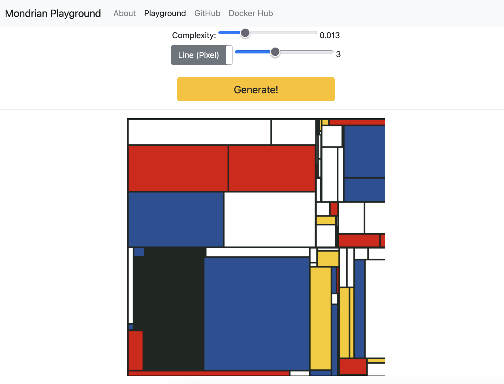

A Mondrian image generator in Go takes a canvas of a certain size and divides it into partitions, thus creating
a Piet Mondrian inspired image with primary colored rectangles. The partition complexity can be varied and can
greatly change how your resulting image looks like. To learn more about the partition complexity and the algorithmic 
approach, check out section "Algorithm description".

The Mondrian generator has the possibility to generate two styles of Mondrian-inspired images:
- the classical Mondrian image with primary colored rectangle partitions which are outlined with black lines
- a more abstract Mondrian inspired image with only primary colored rectangles which are not outlined. 

 Feel free to check out the [mondrian playground](https://mondrian-play.azurewebsites.net/)  or [ github](https://github.com/vvkorz/mondrian) repo.

## The Mondrian Process

The core of the algorithm is the 2D Mondrian Process, as defined in [this paper](https://citeseerx.ist.psu.edu/viewdoc/download?doi=10.1.1.564.8410&rep=rep1&type=pdf).
We describe the 2D Mondrian Process `M ~ MP(lambda, x0, x1, y0, y1)` on the rectangle `(x0, x1) x (y0, y1)` with initial budget `lambda = x1 - x0 + y1 - y0`.
A horizontal y-axis-aligned cut is made uniformly at random along the interval `(y0, y1)`. The new point `y_new` splits `(y0, y1)` into
two intervals `(y_new, y1)` and `(y0, y_new)` and the initial budget `lambda` is regenerated as `lambda_new = lambda - Expcost`, where
`Expcost ~ Exp(x1 - x0 + y1 - y0)` is drawn from the exponential distribution with rate the sum of intervals.
The process then recurses, generating independent Mondrian Processes `MP(lambda_new, x0, x1, y_new, y1)` and `MP(lambda_new, x0, x1, y0, y_new)` with diminished budget parameter `lambda_new`.
The parameter `lambda` controls the number of cuts, with the process more likely to cut rectangles with large perimeters.
The recursive process stops when `lambda_new < 0`, thus the budget is exhausted.

Interestingly enough, setting `lambda_new = lambda - Expcost`, where `Expcost ~ Exp(x1 - x0 + y1 - y0)` did not yield expected 
aesthetic results in our case because the inital budget was used up too slowly, which generated too many partitions. Trying out
a Poisson distribution for the cost reduction also did not yield expected results becuse now the budget was used up to quickly, 
generating too few partitions. Finally, after trying the Gamma distribution (as part of the exponential distribution family we had a gut feeling that it might be a good fit),
satisfying aesthetic results could be generated. Letting the `alpha` parameter fixed at `alpha = x1 - x0 + y1 - y0` while we 
varied the `beta` parameter with a complexity factor greather than 0 (`beta = (y1 - y0) * complexity`), allowed us to generate
partitions with slightly varied partition depth.

## The algorithm

The partitioning algorithm takes a rectangle and splits it in two rectangles of randomly chosen sizes. This process continues
for the new two rectangles, which are again split in two and so on. In order to prevent an infinite splitting of rectangles and
ensure that the partitioning will eventually stop, we assign a starting budget `lambda`, which is reduced after every new partitioning.
If the rectangle to be partitioned is large, a lower amount is deducted from the cost, in order to make the algorithm rather split
the larger rectangles than the small ones.

The algorithm takes the following input parameters:
- a fixed 2D empty canvas size (in pixels), for example 500x500. This will be the base rectangle for the first partitioning.
- an initial Mondrian Process with parameters `x1` and `y1` set to the initial canvas size and initial budget parameter `lambda` set to `x1 - x0 + y1 - y0`.
- boolean parameter `horizontal`, which tells the algorithm if the first cut should be horizontal (when `horizontal=true`) or vertical (when `horizontal=false`).
- partitioning complexity parameter, which is directly embedded into the calculation of the partitioning cost deduction and thus controls how deep the algorithm will split the rectangles.

Without loss of generality let us assume that `horizontal=true`, meaning that the first split will be horizontal. 
- The algorithm starts with the initial rectangle represented by the Mondrian Process `MP(lambda, x0, x1, y0, y1)` 
of the initial canvas size and chooses a point `y_new` within the `(y0, y1)` interval uniformly at random.
- It calculates the cost of the split and the new reduced budget `lambda_new = lambda - Gammacost`, where `Gammacost` is a random sample taken
from the Gamma distribution with parameters	`alpha = x1 - x0 + y1 - y0` and `beta = (y1 - y0) * complexity`.
- The result are two new Mondrian Processes `MP(lambda_new, x0, x1, y0, y_new)` and `MP(lambda_new, x0, x1, y_new, y1)`.
- The algorithm then runs recursively for the two new Mondrian Processes with `horizontal=false`, meaning that the following
partition will be made vertically.
- For `lambda_new` the recursion stops and all previously made partitions (rectangles) are returned in a single data type.
To prevent large data sets being passed around between recursions, the algorithm works with pointers, reading data directly from memory and altering it there.

- [Mondrian Process](https://citeseerx.ist.psu.edu/viewdoc/download?doi=10.1.1.564.8410&rep=rep1&type=pdf)
- [GoMondrian](https://github.com/8lall0/GoMondrian)
- [generativeart](https://github.com/jdxyw/generativeart)

