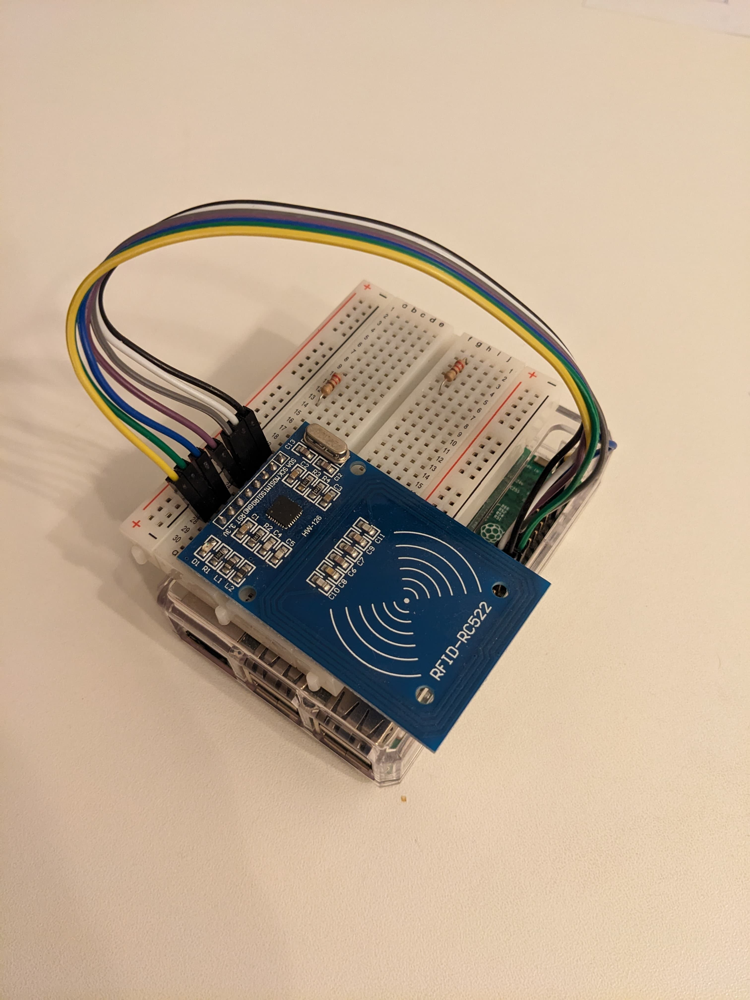

During [COVID-19](https://de.wikipedia.org/wiki/COVID-19) isolation in home office I needed some refreshment in my daily routine. In order to get a feeling of "going to work" I took a walk in the morning around my place and then "cheked in" to start my day. 

In order to have a very authentic feeling I have build a small system to check-in with my work rfid card. I used Raspberry Pi, RFID antenna ([MFRC522-python](https://github.com/mxgxw/MFRC522-python)), [SPI-Py](https://github.com/lthiery/SPI-Py) and [Dropbox API](https://www.dropbox.com/developers/documentation/http/overview) to save files with my hours.

Everything looked a bit rough like so:

I still have the code on my private [github](https://github.com/vvkorz/rfid). The work largely borrowed from [integrate-rfid-module-raspberry-pi](https://www.deviceplus.com/raspberry-pi/integrate-rfid-module-raspberry-pi/) and [raspberry-pi-rfid-rc522](https://pimylifeup.com/raspberry-pi-rfid-rc522/) posts.
